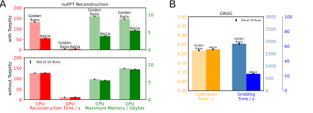

## Figure 4: GROG Gridding

All analysis steps can be run using

`./run.sh`.

To run all figures execute

`./run_figs.sh`.

To generate the final output make sure to run `04a_speedup_num_error/run_figs.sh` first, because it generates part A and the scripts in this repository require A to combine it with the created part B to the output below.

#### Output:
